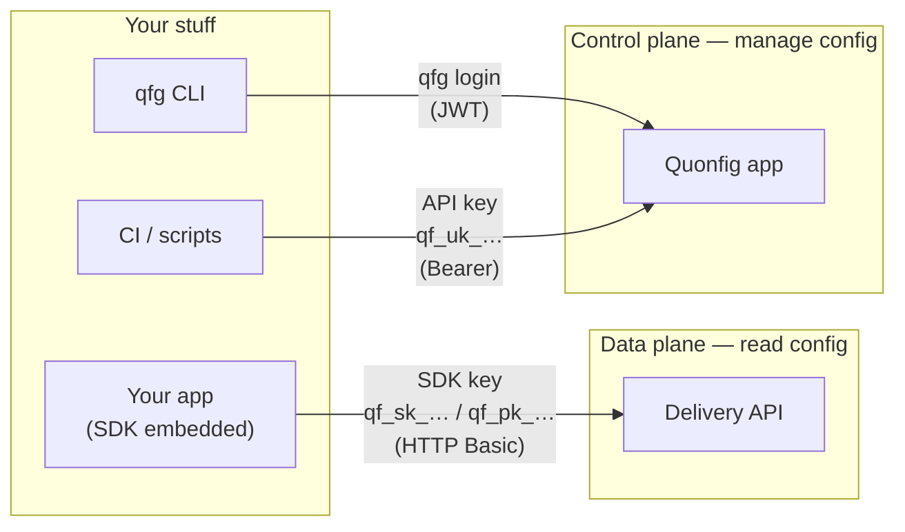

# Keys & Credentials

Quonfig has three kinds of credential, and they are not interchangeable.

**If you just want your app to read flags and configs, you want an
[SDK key](#sdk-keys--your-app-reading-config).** That's the only credential most
applications ever need. The rest of this page is the canonical reference for all
three, so you can read it once and never reach for the wrong one.

## The mental model

Quonfig has two planes. The **data plane** (the delivery API) hands evaluated
config to your running application — it is on the hot path, and an **SDK key**
authenticates to it. The **control plane** (the Quonfig app) is where you *manage*
config — create flags, edit rules, push changes — and *you* authenticate to it,
either interactively with `qfg login` or programmatically with an **API key**.

In one line: **SDK keys read; you (or your CI) write.**

Identity lives on the control plane and is deliberately kept *off* the data
plane. That same decision is why
[Personal Overrides](/docs/explanations/features/personal-overrides) have to
carry your identity into the data plane *as context*: the SDK key won't carry it
for you.

## Which one do I use?

| I want to… | Use |
|---|---|
| Read flags/config from my **server** app | Backend SDK key (`qf_sk_…`) |
| Read flags from my **browser / mobile** app | Frontend SDK key (`qf_pk_…`) |
| Manage config from my **laptop** (CLI) | `qfg login` |
| Manage config from **CI / a script** | API key (`qf_uk_…`) |
| Resolve config into env vars at build/deploy time | [`qfg run`](/docs/tools/qfg-run) with a backend SDK key **or** `qfg login` |
| Override a flag **just for me** in local dev | An SDK key **and** `qfg login` — see [Personal Overrides](/docs/explanations/features/personal-overrides) |

## The credentials in detail

### SDK keys — your app reading config

SDK keys are what your **running application** uses to fetch config from
the delivery API. They resolve to a single `{workspace, environment}` pair and
**carry no user identity** — they say *which* config to serve, never *who* is
asking. Because there's nothing personal in them, a development SDK key is meant
to be **shared across your team**; you don't create one per developer. There are
two flavors:

- **Backend SDK key (`qf_sk_…`, _secret_)** — for server-side SDKs (Node, Go,
  Python, Ruby, Java, .NET). The SDK downloads the full config envelope and
  evaluates **in-process**, so it can see your raw targeting rules.
  **Never ship it to a browser.**
- **Frontend SDK key (`qf_pk_…`, _public_)** — for browser, React, React
  Native, and other client SDKs. Safe to ship in client bundles because
  **evaluation happens server-side** by the delivery API — the browser only ever
  receives evaluated values, never raw rules, and only configs marked "send to
  frontend SDKs."

See [Backend SDKs](/docs/explanations/concepts/backend-sdks) and
[Frontend SDKs](/docs/explanations/concepts/frontend-sdks) for how each one
fetches and evaluates.

### API keys — automation managing config

An API key (`qf_uk_…`) is **you, as a credential**: programmatic access to the
control plane for CI and scripts. It lets a non-interactive process do what you
could do by hand — list flags, edit config, push changes, generate types.

Reach for it only when there's no human at a browser to complete an OAuth flow:
a CI job running `qfg generate`, a deploy step running
[`qfg run`](/docs/tools/qfg-run), a migration script. It does **not**
authenticate to the delivery API, so you can't use it to read config from an SDK.

### `qfg login` — you, at your desk

`qfg login` is the **interactive, human** equivalent of an API key. It runs a
device-code OAuth flow in your browser and stores the resulting token
locally. Every management command from the CLI — `qfg list`, `qfg push`,
`qfg set-default`, `qfg override` — rides on it. Use `qfg login` at your desk;
use an API key in automation.

## Local dev: one shared SDK key + your own `qfg login`

The intended setup is simpler than you might expect. Your team shares **one
development SDK key** — you do *not* make a personal one per developer. An SDK
key carries no identity, so there's nothing personal in it to separate; a single
development key (kept in your team's `.env.example`, say) is the norm.

What makes local dev *yours* is **`qfg login`**, not a personal key. Logging in
identifies you to the control plane — that's how you manage config and how your
[personal overrides](/docs/explanations/features/personal-overrides) resolve to
*your* values: your identity rides in as evaluation context while the shared SDK
key just says which environment to read. So day to day you hold two credentials
at once — the shared SDK key (your app reads config) and your own `qfg login`
(you manage config and see your own overrides).

## Reference & anti-patterns

The full reference, for quick lookup and for agents wiring up an integration.

| Credential | Looks like | Conventional env var | Auth scheme | Talks to | Identity? |
|---|---|---|---|---|---|
| Backend SDK key | `qf_sk_…` | `QUONFIG_BACKEND_SDK_KEY` | HTTP Basic (`1:<key>`) | Delivery API (reads) | No — workspace + environment |
| Frontend SDK key | `qf_pk_…` | `QUONFIG_FRONTEND_SDK_KEY` (behind a framework prefix: `NEXT_PUBLIC_`, `VITE_`, `REACT_APP_`) | HTTP Basic (`1:<key>`) | Delivery API (reads, evaluated server-side) | No — workspace + environment |
| API key | `qf_uk_…` | `QUONFIG_API_KEY` (pair with `QUONFIG_WORKSPACE`) | Bearer | Quonfig app (manage) | Yes — acts as *you* |
| `qfg login` | a stored token, not a string you paste | — (stored under `~/.quonfig/`) | JWT | Quonfig app (manage) | Yes — acts as *you* |

Don't:

- **Don't put a backend key (`qf_sk_…`) in browser or client code** — it can
  read your raw rules. Use a frontend key (`qf_pk_…`).
- **Don't use an API key (`qf_uk_…`) to read flags from your app** — it doesn't
  authenticate to the delivery API. Use an SDK key.
- **Don't use an SDK key to manage config** — it can't reach the control plane.
- **Don't commit real keys.** SDK keys are shown once at creation; rotate freely
  by making new ones.
