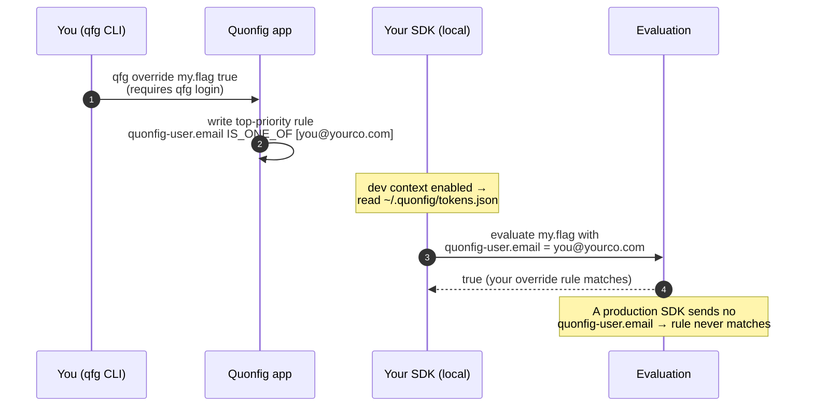

# Personal Overrides

A personal override lets you flip a flag (or change a config value) **for just
yourself** while you develop, without touching what anyone else sees and without
editing the flag's real rules. You set it once with `qfg override`, and your
local app starts seeing your value — everyone else, including production, is
unaffected.

```bash
qfg override my.flag true        # I now see `true` for my.flag; nobody else does
qfg override my.flag --remove    # back to normal
```

## How it actually works

It helps to know the mechanism, because it explains the setup steps below (and
why they exist).

A personal override is **not** a magic local-only toggle. `qfg override` writes
a real, top-priority **rule** onto the flag, keyed on a special property,
`quonfig-user.email`:

> if `quonfig-user.email` is one of `["you@yourco.com"]` → your value

That rule lives in your workspace config and is visible in the dashboard like
any other rule — which is the point: there are no invisible, "works on my
laptop" overrides hiding in a dotfile somewhere. The override only *fires* for a
client that sends your email as `quonfig-user.email` in its evaluation context.

The clever part is the `quonfig-user.` namespace. **Production never sets it.**
A production server doesn't run `qfg login`, so it has no saved identity to
inject, so the attribute is never on the context, so the rule can never match.
The override is *dead code in production by construction* — which is why it is
safe to leave these rules sitting in your config.



So three things must line up for an override to take effect:

1. **The rule exists** — `qfg override` put it there (this needs `qfg login`).
2. **The SDK sends your email** as `quonfig-user.email` context.
3. **You're in local dev**, where step 2 is possible.

The setup below is entirely about making step 2 happen.

## Setup (backend SDKs)

You need both credentials described in
[Keys & Credentials](/docs/explanations/concepts/keys-and-credentials) — an SDK
key (so your app can read config at all) **and** `qfg login` (so there's an
identity to inject and so you can set overrides).

**1. Log in** so the CLI knows who you are and can write override rules:

```bash
qfg login
```

**2. Run your app with an SDK key as normal** (`QUONFIG_BACKEND_SDK_KEY=qf_sk_…`).

**3. Turn on dev-context injection** so the SDK reads your saved login identity
(`~/.quonfig/tokens.json`) and injects `{ "quonfig-user": { email } }` into
every evaluation. This is **opt-in** — set the env var, or pass the constructor
option:

```bash
export QUONFIG_DEV_CONTEXT=true   # works for every SDK that supports injection
```

| Backend SDK | How to enable |
|---|---|
| Node | `QUONFIG_DEV_CONTEXT=true` or `new Quonfig({ enableQuonfigUserContext: true })` |
| Go | `QUONFIG_DEV_CONTEXT=true` or `WithQuonfigUserContext(true)` |
| Python | `QUONFIG_DEV_CONTEXT=true` or `Options(enable_quonfig_user_context=True)` |
| Ruby | `QUONFIG_DEV_CONTEXT=true` or `enable_quonfig_user_context: true` |

Any backend SDK can also just pass `quonfig-user.email` on the context directly
(see [Frontends: pass the context yourself](#frontends-pass-the-context-yourself)) —
that always works, whether or not auto-injection is wired up.

**4. Set an override** and run your app:

```bash
qfg override my.flag true
```

:::tip Why is this opt-in?
The SDK only injects your email when you ask it to. Default-on would mean any
machine that ever ran `qfg login` (a shared CI runner, a staging box) starts
emitting a developer's email into evaluation context and telemetry, and could
silently activate overrides off your laptop. Keeping it opt-in keeps the
"dead in prod" guarantee honest.
:::

## Frontends: pass the context yourself

Auto-injection works by reading the `qfg login` token file on disk, so it's a
backend convenience. Frontend SDKs (browser, React, React Native) evaluate
[server-side](/docs/explanations/concepts/frontend-sdks), so the way to use an
override there is to **put `quonfig-user.email` on the evaluation context
yourself.** You send the context up, the delivery API evaluates your override rule
against it, and you get your value back:

```typescript
// Gate it on a dev build so it never ships to real users.
const devContext = import.meta.env.DEV
  ? { "quonfig-user": { email: "you@yourco.com" } }
  : {};
```

This is the same context-injection you'd use to feed **any** dev or user
attribute into evaluation — a personal override is just one thing that context
can drive. The one thing to get right: because the email is a value you supply
rather than a logged-in identity, it must exactly match the address your
override rule was written for.

## Overrides and production

You *can* set an override targeting `production`, and the CLI will let you — but
it is **inert for normal production traffic**, because production SDKs don't send
`quonfig-user.email`. The CLI prints a soft warning when you target
`production` for exactly this reason. Personal overrides are a local-development
tool; to change what real users get, edit the flag's actual rules (see
[`qfg set-default`, `qfg set-rollout`, and targeting rules](/docs/tools/cli#targeting-rules)).

## Related

- [Keys & Credentials](/docs/explanations/concepts/keys-and-credentials) — SDK
  keys vs. API keys vs. `qfg login`, and why an override needs both an SDK key
  and a login.
- [`qfg override` command reference](/docs/tools/cli#override)
- [Context](/docs/explanations/concepts/context) — how evaluation context and
  namespaced properties like `quonfig-user.email` work.
