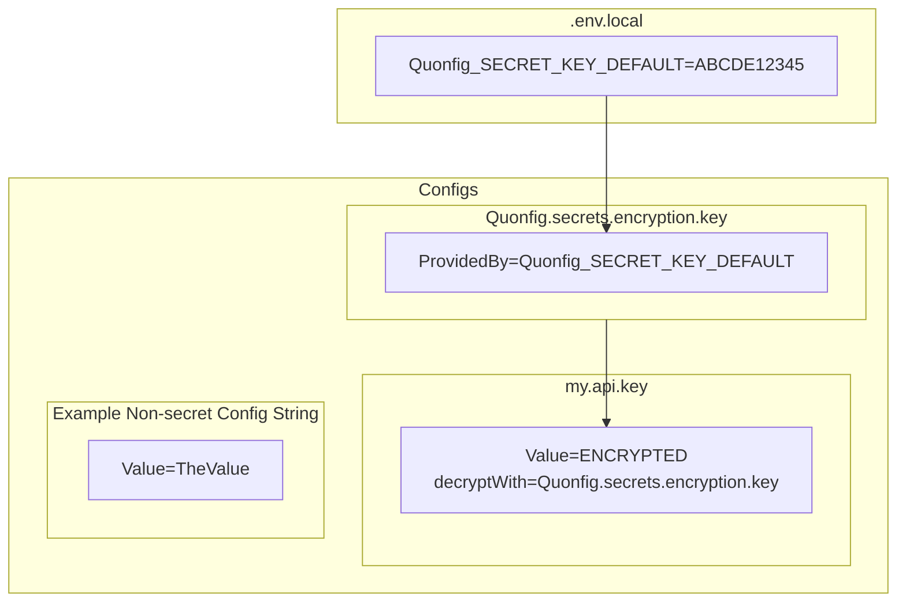
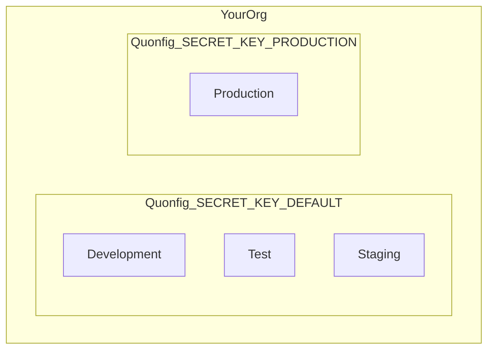
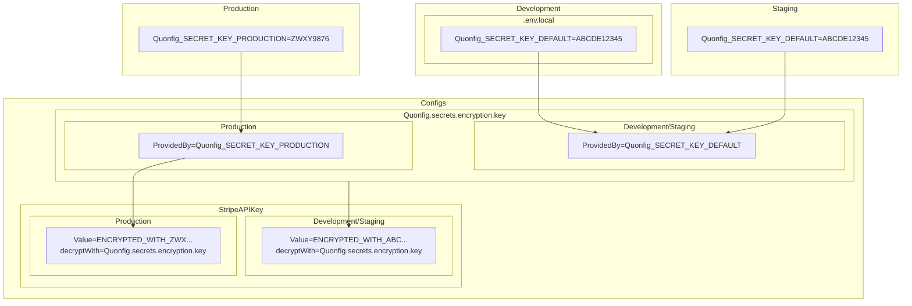

Quonfig has zero-knowledge support for [sharing your secrets](https://quonfig.com/features/secret-management/) between developers and between your different applications. We use simple & straightforward cryptography and Quonfig never sees anything unencrypted. This simplifies sharing secrets for local development and sharing secrets between multiple applications or languages because you only need a single encryption/decryption secret. (Multiple secrets is perfectly fine too, use as many as you require).

Quonfig owns: 
- CLI to locally encrypt and push to Quonfig
- Distributing the encrypted values to your systems
- SDKs to decrypt `Quonfig.get("my-secret") => "the message"`

You own:
- Sharing the encryption/decryption secret(s) with the correct people / services

## How Does It Work

1. You create a `secret key` with the CLI. This is a series of random bytes that you keep secret.
2. This `secret key` needs to be available on developer machines to encrypt and in deployed environments to decrypt, you do this via your existing process for sharing environment variables.
3. You use our [CLI](/docs/tools/cli) to encrypt the string you want to keep secret. 
4. Quonfig will share the encrypted contents with your applications.
5. Your applications will decrypt the contents with the `secret key`.

## What Does That Look Like?
[](https://www.youtube.com/watch?v=el_IEDCfoIU)

## Walkthrough

Quonfig secret management uses standard Quonfig dynamic configuration to store and share your secrets between your applications.

In particular, it uses two special types of configuration attributes: `decryptWith` and `provided`. Let's see how these work together.

### Step 1: Create an Encryption Key

Quonfig allows you to declare that a configuration value will be *"provided by"* an environment variable. Quonfig will store a config that is kind of an empty vessel. It is a pointer that says "find my value from this ENV VAR".

We want Quonfig to have zero knowledge of your encryption key, so we'll use these provided values so you don't have to tell us the encryption key.

#### Create the Provided By Env Var Config

```bash
Quonfig create Quonfig.secrets.encryption.key --env-var=Quonfig_SECRET_KEY_DEFAULT --type string --confidential
```

This creates:
1. A config called `Quonfig.secrets.encryption.key`
2. That will resolve to `Quonfig_SECRET_KEY_DEFAULT`
3. That won't report/print the value because it's `--confidential`

#### Put something in the vessel locally

We'll generate a secure series of random bytes to be our encryption key.
```bash
> Quonfig generate-new-hex-key
17f65155e45a42777d89091e40cddc5541ac4851c44134f86db7a408a7fea5a8
```

Now we put this into our environment using something like a `.env.local` file.
```bash
#.env.local
Quonfig_SECRET_KEY_DEFAULT=17f65155e45a42777d89091e40cddc5541ac4851c44134f86db7a408a7fea5a8
```

If we run our application now and call `Quonfig.get("Quonfig.secrets.encryption.key")` we'll get `17f65155e45a42777d89091e40cddc5541ac4851c44134f86db7a408a7fea5a8`.


## Step 2: Encrypt Something

#### Encrypt a value

```bash
Quonfig create my.api.key --type string --value="sample api key" --secret
```

This will:
1. Assume that we are using the value of `Quonfig.secrets.encryption.key` to encrypt.
2. Pull the key from our environment.
3. Use that key to encrypt `sample api key`
4. Push and encrypted blob to Quonfig under the key `my.api.key`


Here's a pictorial representation of what we've done so far



## Step 3: Using the Secret

Locally, we're all set. We can use the language appropriate form of `Quonfig.get("my.api.key")` and the library will decrypt our secret. 

To use the secret in another environment, you just need to get `Quonfig_SECRET_KEY_DEFAULT=17f65155e45a42777d89091e40cddc5541ac4851c44134f86db7a408a7fea5a8`
set in that environment.

## Separate Keys For Different Environments

So far, we've shared the same secret for development and staging, but it's very likely you'll want a different key for your production secrets. This is no problem. The nature of `provided` means that our `Quonfig.secrets.encryption.key` can resolve to different ENV vars in different environments.

#### Generate a second secret
```bash
> Quonfig generate-new-hex-key
17f65155e45a42777d89091e40cddc5541ac4851c44134f86db7a408a7fea5a8
```

#### Put that secret into a separate env var

Why use a second env var? Well, you aren't required to. You could share the same name for the env var in all your environments. 

The trick is that this can make using the CLI locally more challenging. Locally, the CLI will need to be able to encrypt for both the default and production environments. We find it is easier to have them use different names so they don't collide locally. Here's what that looks like

```bash
#.env.local
Quonfig_SECRET_KEY_DEFAULT=17f65155e45a42777d89091e40cddc5541ac4851c44134f86db7a408a7fea5a8
Quonfig_SECRET_KEY_PRODUCTION=994899132443777d89091e40cddc5541abdeff123830488a7fea173b3b1b2b38
```

#### Update the Quonfig.secrets.encryption.key to look for the other ENV var in production
```bash
$ Quonfig change-default --confidential --env-var=Quonfig_SECRET_KEY_PRODUCTION              

? Which item would you like to change the default for? Quonfig.secrets.encryption.key
? Which environment would you like to change the default for? Production
Confirm: change the default for Quonfig.secrets.encryption.key in Production to be provided by `Quonfig_SECRET_KEY_PRODUCTION`? yes/no: yes
✔ Successfully changed default to be provided by `Quonfig_SECRET_KEY_PRODUCTION` (confidential)
```

This is now the mapping of environment to ENV Var. 


We can also see this by running `Quonfig info`.
```bash
$ Quonfig info  Quonfig.secrets.encryption.key

- Default: `Quonfig_SECRET_KEY_DEFAULT` via ENV
- Development: [inherit]
- Production: `Quonfig_SECRET_KEY_PRODUCTION` via ENV

No evaluations in the past 24 hours
```


#### Set a Secret in Production

Finally, let's set a production secret.

```bash
$ Quonfig change-default
? Which item would you like to change the default for? my.api.key
? Which environment would you like to change the default for? Production
Default value: sk_live_123
Confirm: change the default for my.new.string in Production to `sk_live_123`? yes/no: yes
✔ Successfully changed default to `sk_live_123`
```

:::tip
Note: You can use as many encryption keys as you want. It is a common practice to have 2, one for production and one for all other environments. But you can have as many secrets as you need in order to align with the trust groups you require.
:::


## Full Example Diagram




## How should I get the actual Secret keys passed around.

In order to share the `Quonfig_SECRET_KEY_DEFAULT` with developers, you can use a password manager such as 1Password or you can use one of the secure 1-time password sharing website like [1ty.me](https://1ty.me/) [onetimesecret](https://onetimesecret.com/) or [password.link](https://password.link/).

This will be the only secret you ever need to share amongst your developers going forward. 


## How do secrets work in  CI?

Because Quonfig secret management uses the regular dynamic configuration, you'll use the same techniques to run in continuous integration environments which may be offline. The full guide is available in [Testing](/docs/explanations/concepts/testing). The only thing you'll need to remember is to make `Quonfig_SECRET_KEY_DEFAULT` available to processes in CI. 

